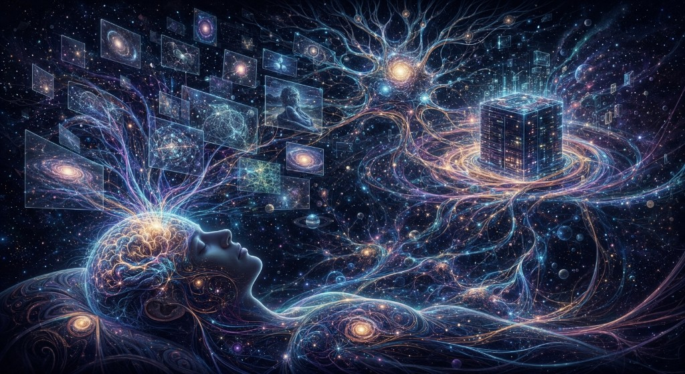
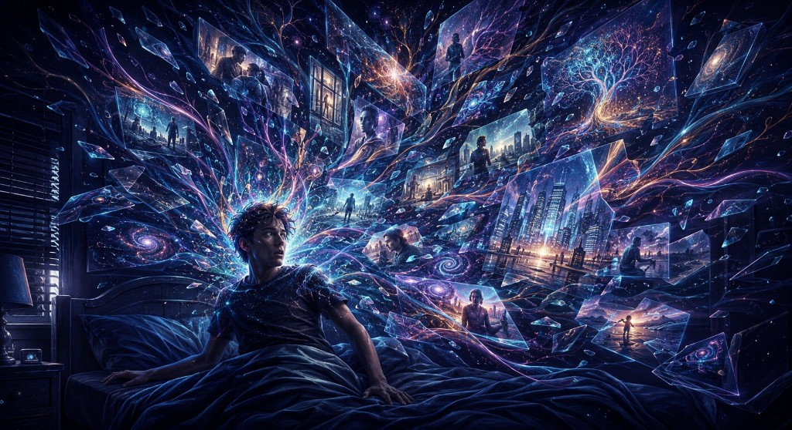
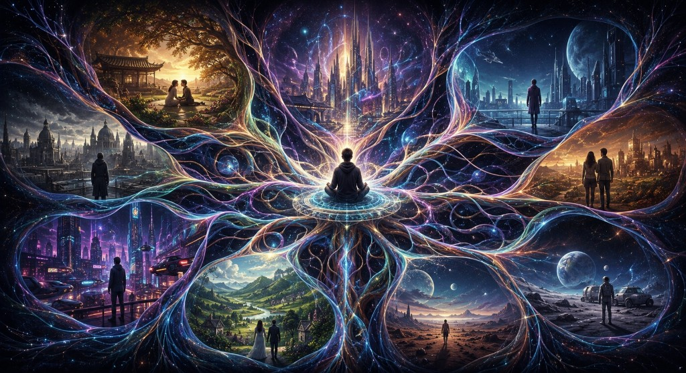
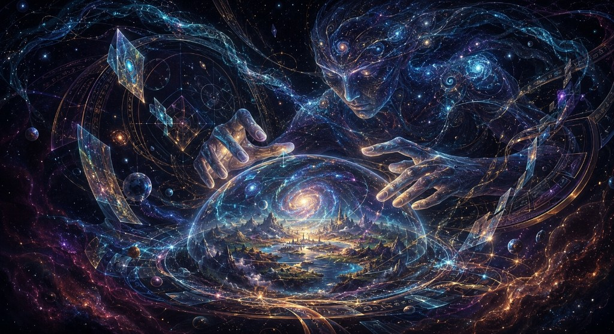
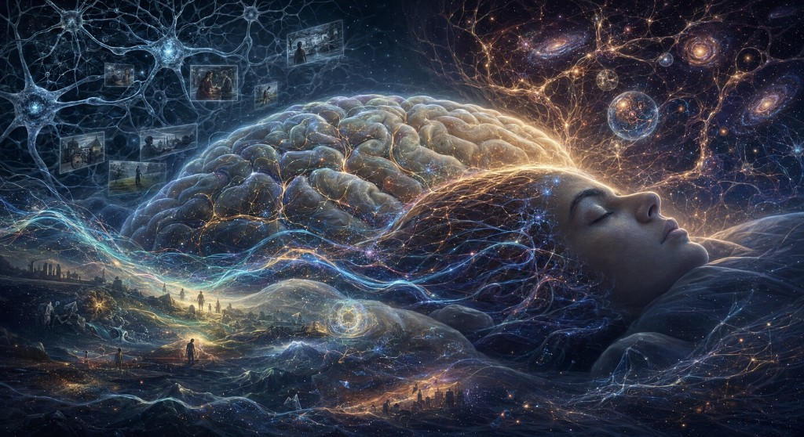

## Why dreams feel like a software glitch in a 3D simulation

> A speculative thought experiment about sleep, memory, parallel worlds, and the possibility that we wake up before the universe finishes syncing.

There is a particular kind of dream that leaves you briefly homesick for a place that never existed.

You wake at 3:00 a.m. with your heart racing. A city is still glowing behind your eyelids: its streets unfamiliar, its skyline impossible. Someone you have never met was beside you, and yet the loss of them feels intimate. For a few seconds, the dream is not a dream. It is somewhere you have just returned from.

Then the architecture collapses.

The city becomes a room. The room becomes your bedroom. The stranger’s face dissolves before you can name it. What felt like a complete world becomes a handful of disconnected images, emotional aftershocks and a sentence you cannot quite remember.

Neuroscience has several powerful ways of describing this. During sleep, the brain cycles through changing states of activity. REM sleep, the stage most strongly associated with vivid dreaming, combines heightened brain activity with temporary muscle paralysis and shifting emotional and memory processes. Sleep also appears to help reorganise, integrate and generalise what we experienced while awake. The brain is not simply switched off.

But science has not finished explaining why a dream can feel like a universe one moment and like corrupted footage the next.

So let us try a different lens, not as a proven explanation, but as a philosophical thought experiment.

What if the brain is not inventing every dream from scratch?

What if it is trying to decode a file while the system is defragmenting?

Welcome to the **Multiverse Sync Theory of Dreaming**.

---

## 1. The nightly log-off

### The brain as a local terminal

Imagine that waking consciousness is a rendering process.

Your brain receives signals from the body and the world, filters them through memory and expectation, and constructs the seamless scene you call “now.” You do not experience individual photons, electrical impulses or muscle signals. You experience a room, a face, a cup of tea, a self.

The simulation metaphor begins here, not with the claim that reality is literally running on a computer, but with a useful observation: your experienced world is assembled. It is a live model, continuously updated from incoming data and stored history.

In this thought experiment, waking consciousness is a local session. It is optimised for one body, one location, one apparent timeline. Attention narrows the immense possible world into the small slice required to cross a street, answer a message or remember why you entered a room.

Sleep changes the operating conditions.

The body becomes still. External input is reduced. Attention loosens its grip on the present. Memories are reactivated, emotions are processed, and associations that would normally be kept apart may begin to mingle.

The speculative leap is to imagine that this “background” is not only biological. Suppose consciousness is a node in a larger information field: a local terminal connected to a cosmic network. During the day, the terminal renders the immediate world. At night, it uploads the day’s experiences, re-indexes memory and downloads fragments from elsewhere in the network.

The “elsewhere” might mean the unconscious mind. It might mean the collective imagination. Or, in the most extravagant version, it might mean other branches of reality.

There is no evidence that the brain literally connects to a multiverse server. That is the point at which metaphor becomes metaphysics. But the metaphor is seductive because it maps neatly onto an observable fact: the sleeping brain is doing consequential work while the conscious narrator is temporarily absent.

---

## 2. The defragmentation glitch

### Why waking up can feel like catching the system mid-process

A dream often has no respect for continuity.

You are in a train station. The station is suddenly your childhood home. Your childhood home has a coastline. You are running, but your legs are moving through water. Nobody questions the transition, not even you.

While dreaming, contradiction is tolerated. Time stretches and contracts. People change identity without explanation. A room can retain its emotional meaning while changing its physical shape.

The computer analogy gives this instability a memorable shape.

Picture a hard drive rearranging fragments of data. Files are being moved, indexed and recombined. Temporary caches are opening and closing. The system may be performing a perfectly orderly process, but if you could watch every operation at once, the screen would look chaotic.

Now imagine turning the monitor on in the middle of it.

You would not see the finished file. You would see pieces: a half-rendered image, a directory name, a flash of colour, a window that appears and vanishes before it can be understood.

In the Multiverse Sync Theory, this is what happens when consciousness returns before the background process has finished. The waking mind demands a single timeline, a stable body and a familiar room. The dream is still holding several incompatible scenes in working memory. The result is the peculiar violence of awakening: the universe snaps into place, and everything else is discarded.

This also explains why dreams evaporate so quickly. The moment you wake, the brain’s priorities change. The dream’s temporary associations are not necessarily stored in the same stable form as an ordinary waking event. The narrative begins to dissolve before language can capture it.

You are not forgetting a story so much as losing access to the system that was rendering it.

---

## 3. Cross-chatter from parallel timelines

### The multiverse enters the room

Now the theory takes its most dangerous, and most entertaining, step.

In the Many-Worlds Interpretation of quantum mechanics, the universal wavefunction evolves without a special collapse rule. Interactions produce decohered branches that can be described as different outcomes or “worlds.” This is a serious interpretation of quantum theory, but it is not a licence to claim that human dreams receive radio signals from alternate universes.

The theory proposed here is fiction built in the shadow of that idea.

Suppose reality is not a single story but an expanding library of possible histories. Most branches are inaccessible to one another. They do not send messages. They do not exchange memories. They simply exist as different physical descriptions of what could happen.

Then what could a dream be?

Perhaps it is the brain’s private theatre for recombining its own material. Or perhaps, in the speculative version, it is an accidental receiver. Not a portal. Not a psychic telephone. A receiver in the poetic sense: a system sensitive enough to produce patterns that feel larger than the information it can consciously account for.

In that imagined network:

- The unfamiliar city is a local render from a history in which architecture took another path.
- The stranger you loved is a compressed emotional trace of a life in which one decision went differently.
- The sudden fall is the mind’s symbolic rendering of vulnerability, loss or an alternate outcome.
- The impossible object is a collision between memory fragments that would never meet during the day.

The brain, faced with these unlinked packets, does what it does best: it makes a story. It assigns a body to the emotion, a room to the memory and a sequence to the fragments.

Dreams may not reveal other worlds. They reveal how desperately the mind wants a world to make sense.

---

## 4. The creator’s console

### If reality is simulated, who is watching the logs?

Every simulation story eventually creates a shadow in the corner: the creator.

Nick Bostrom’s simulation argument does not prove that we live inside a computer. It presents a trilemma: either civilisations tend to disappear before becoming capable of running vast ancestor simulations, or advanced civilisations rarely run them, or simulated observers could vastly outnumber non-simulated ones. If the third condition were true, we might reason that we are more likely to be simulated than original.

That argument is philosophical and probabilistic. It does not identify a programmer, a purpose or a cosmic control panel.

Yet the idea of a creator remains emotionally powerful because it translates old theological questions into a technological vocabulary. The designer becomes an engineer. Providence becomes system architecture. Prayer becomes a request sent upstream. Fate becomes a hidden ruleset. Miracles become privileged access.

If such a creator existed, dreams would be an odd place to look for evidence. Dreams are private, unstable and resistant to verification. A message from a creator that cannot survive ten seconds of waking memory is not an especially efficient message.

But perhaps that is the point.

Perhaps the system is not trying to communicate propositions. Perhaps it is showing us the limits of the interface. Every night, the stable world is removed and reconstructed. The self becomes mobile. Time loses its authority. The mind discovers that the feeling of reality can survive even when the rules of reality are gone.

The “creator’s conspiracy” may not be that a god is secretly sending us clues. It may be that whatever created consciousness built a system in which the user can never inspect the source code directly.

---

## 5. The science check

### What the evidence supports, and what it does not

The imaginative theory becomes more interesting when we are precise about its boundaries.

Science supports several pieces of the metaphor:

1. Sleep is an active biological state, not a simple shutdown.
2. REM sleep involves distinctive brain activity and is strongly associated with vivid dreams.
3. Sleep contributes to memory processing, although the exact role of dreaming itself remains an open research question.
4. Dreams can recombine memories, emotions and concepts in unusual ways.
5. Waking during or near vivid dream states can leave experiences feeling fragmented, emotionally intense and difficult to recall.

Science does not currently support these stronger claims:

1. The brain has been shown to connect to parallel universes during sleep.
2. Dreams are downloads from alternate timelines.
3. REM sleep is a literal defragmentation process in a simulated universe.
4. A dream character is evidence of a person who exists in another branch of reality.
5. Quantum mechanics gives consciousness a special ability to browse the multiverse.

This distinction is not a buzzkill. It is what lets the story remain intellectually alive. Once a metaphor is presented as a measurement, wonder collapses into misinformation. A good speculative essay does something more durable: it puts established facts and imaginative possibility side by side, then lets the reader feel the tension between them.

The scientific explanation may be enough. Memory consolidation, emotional processing, predictive modelling and spontaneous neural activity can produce astonishing experiences. “Random” does not mean meaningless; a brain can turn noisy input into patterns, just as a cloud can resemble a face without containing a face.

But the fact that a biological explanation is available does not make the experience emotionally small.

The brain is still the strangest world we have direct access to.

---

## 6. The morning after the download

There is a quiet test for every conspiracy theory: what changes if it is true?

If dreams are cross-chatter from other realities, we should be able to extract information that could not have come from our own experience. We should be able to reproduce the result, distinguish signal from coincidence and make predictions before the evidence arrives.

So far, dreams do not give us that kind of reliable access. They give us images, feelings, metaphors and occasional creative breakthroughs. They also give us anxiety, memory distortion and stories assembled from material we did not realise we had noticed.

That makes the Multiverse Sync Theory unlikely as physics, and valuable as a question.

What if the apparent boundary between imagination and perception is not a wall but an interface?

What if consciousness is less like a camera recording reality and more like a renderer constantly negotiating with incomplete data?

What if the self we defend during the day is only one stable configuration among many that the brain can generate?

The next time you wake breathless from a dream that felt real and impossible, you do not have to decide that you visited another dimension. You can hold two thoughts at once:

Your brain was doing something biological, intricate and not yet fully understood.

And the experience may still feel like a message from beyond the ordinary world.

Maybe you did not receive a transmission from a parallel universe. Maybe your mind simply revealed how much of reality it builds in real time.

Or maybe, just for a moment, you woke up while the cosmic software was still running.

You did not just have a dream.

You interrupted a download.

---

## Further reading and related theories

The following sources informed the factual and philosophical boundaries of this essay. They do not establish the Multiverse Sync Theory; that name and synthesis are a creative thought experiment.

- **National Institute of Neurological Disorders and Stroke: “Brain Basics: Understanding Sleep”**: an accessible overview of REM and non-REM sleep, sleep cycles and brain activity. [https://www.ninds.nih.gov/health-information/public-education/brain-basics/brain-basics-understanding-sleep](https://www.ninds.nih.gov/health-information/public-education/brain-basics/brain-basics-understanding-sleep)
- **Siclari et al., “The neural correlates of dreaming”**: a review of research on the brain activity associated with dream experience. [https://pmc.ncbi.nlm.nih.gov/articles/PMC5462120/](https://pmc.ncbi.nlm.nih.gov/articles/PMC5462120/)
- **“Dreaming outside the Box: Evidence for Memory Abstraction in REM Sleep”**: research exploring how REM sleep may reorganise memories and support new associations. [https://pmc.ncbi.nlm.nih.gov/articles/PMC10586531/](https://pmc.ncbi.nlm.nih.gov/articles/PMC10586531/)
- **Nature Reviews / sleep-memory research**: an overview of memory consolidation and targeted memory reactivation during sleep. [https://www.nature.com/articles/s41539-024-00244-8](https://www.nature.com/articles/s41539-024-00244-8)
- **Stanford Encyclopedia of Philosophy: “Many-Worlds Interpretation of Quantum Mechanics”**: a careful philosophical treatment of Everettian quantum mechanics and its limits. [https://plato.stanford.edu/entries/qm-manyworlds/](https://plato.stanford.edu/entries/qm-manyworlds/)
- **Stanford Encyclopedia of Philosophy: “Quantum Mechanics”**: context on interpretations, measurement and what quantum theory does, and does not, say about reality. [https://plato.stanford.edu/entries/qm/](https://plato.stanford.edu/entries/qm/)
- **Nick Bostrom, “Are You Living in a Computer Simulation?”**: the original simulation argument and its three-part structure. [https://simulation-argument.com/simulation.pdf](https://simulation-argument.com/simulation.pdf)
- **Sleep Foundation: “Dreams: Why They Happen & What They Mean”**: a general-audience overview of dreaming, vivid dreams and dream recall. [https://www.sleepfoundation.org/dreams](https://www.sleepfoundation.org/dreams)
- **Hobson and McCarley, “The Brain as a Dream State Generator”**: the classic activation-synthesis proposal, useful as historical background for the idea that the brain constructs narratives from internally generated activity. [https://pubmed.ncbi.nlm.nih.gov/4326795/](https://pubmed.ncbi.nlm.nih.gov/4326795/)

### Editorial note

This essay intentionally uses the language of conspiracy, simulation and cosmic software as literary devices. It should be read as speculative philosophy and science-inspired fiction, not as medical advice, a scientific claim about quantum consciousness, or evidence that dreams transmit information from other universes.
