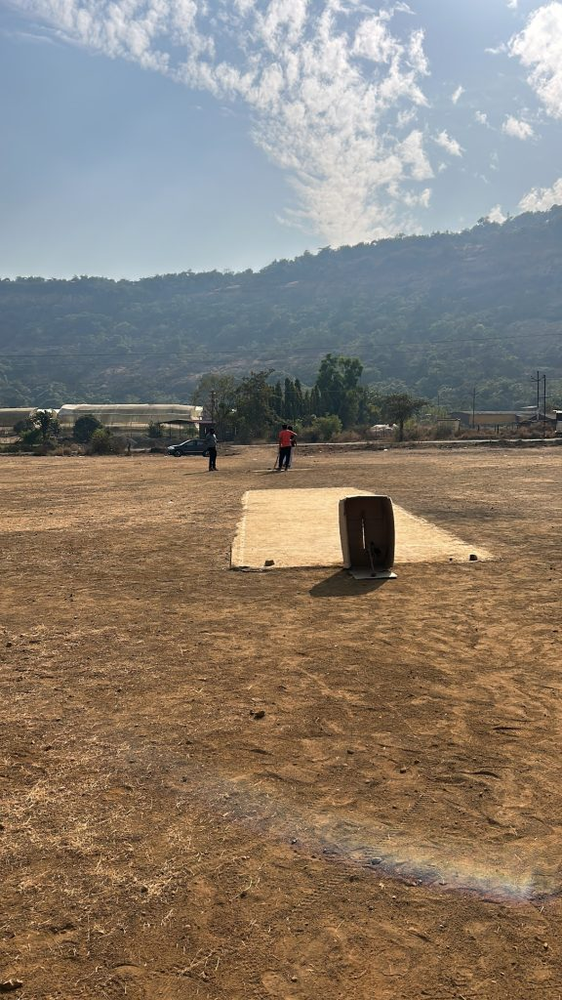
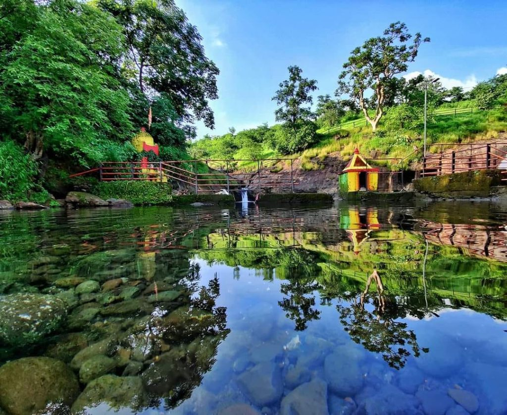
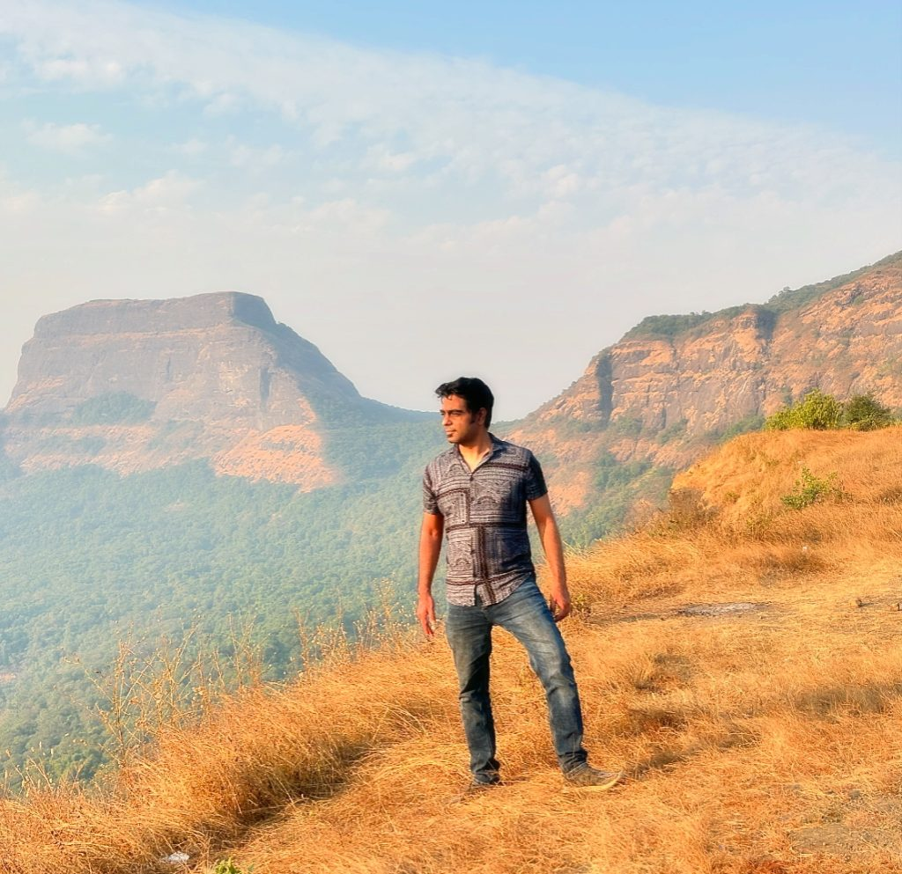
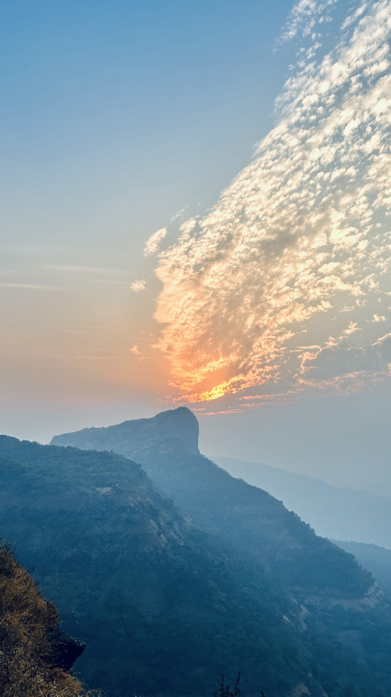

Embarking on a weekend escapade with friends, we set our sights on the quaint village of Jambhavali, nestled in the Mawal taluka of Pune district, Maharashtra. This serene hamlet, encompassing an area of 972 hectares, provided an idyllic commencement to our journey.

The journey from Pune to Kondeshwar Temple is a scenic drive of approximately 50 kilometers, taking around 1.5 to 2 hours, depending on traffic. Starting from Pune, head towards the Mumbai-Pune Expressway and exit at the Karjat or Vadgaon toll plaza. From there, follow the signage toward Badlapur or Jambhavali, and proceed along the well-marked roads. As you approach Kondeshwar, the final stretch involves navigating through narrow village roads flanked by lush greenery, which sets the tone for the serene experience awaiting at the temple. It is advisable to use GPS or ask locals for guidance, as mobile network coverage may vary in some stretches. The picturesque surroundings and tranquil countryside make the drive as enjoyable as the destination itself.

Upon arrival, we were greeted by the verdant expanse of the village cricket grounds. The lush green field, framed by the rustic charm of rural life, beckoned us for a spirited game of cricket. The camaraderie and friendly competition under the expansive sky invigorated our spirits, setting a jubilant tone for the adventures that lay ahead.

Our next destination was the venerable Kondeshwar Temple, a historic shrine dedicated to Lord Shiva. Situated approximately 2 kilometers from Jambhavali, the temple is renowned for its ancient architecture and tranquil ambiance. Surrounded by dense forests and cascading waterfalls during the monsoon season, the temple exudes a serene aura, offering a sanctuary for both devotees and nature enthusiasts.

Pic credits: [Facebook](https://www.facebook.com/p/Kondeshwar-Temple-Waterfalls-100077671208038/)

From Kondeshwar Temple, we embarked on the challenging trek to the Dhak Bahiri caves. This trek, acclaimed as one of the most arduous in the Sahyadri range, demands both physical endurance and mental fortitude. The trail meanders through dense jungles, steep ascents, and rocky terrains, culminating in a near-vertical climb of approximately 70 degrees to reach the caves. The final stretch, equipped with iron railings and ropes, tests the mettle of even seasoned trekkers.

Upon conquering the formidable path, we reached the Dhak Bahiri caves, which house a revered temple of Lord Bahiri (Bhairavnath). Perched at an elevation of about 2,700 feet, the caves offer panoramic vistas of the surrounding Sahyadri peaks, including glimpses of Rajmachi Fort, Visapur Fort, and Manikgad. The sense of accomplishment, coupled with the breathtaking scenery, rendered the arduous trek profoundly rewarding.

Our expedition culminated with a visit to the remnants of Dhak Fort, situated near the caves. The fort, though in ruins, stands as a testament to the region's rich historical tapestry. Exploring the fortifications and ancient structures, we were transported back to an era of valor and grandeur, deepening our appreciation for the cultural heritage of Maharashtra.

As we retraced our steps back to Jambhavali, the weekend's experiences left an indelible imprint on our hearts. The harmonious blend of natural splendor, historical intrigue, and the thrill of adventure fostered a renewed sense of camaraderie among us. This journey through the rustic landscapes and formidable terrains of Maharashtra not only tested our endurance but also enriched our souls, leaving us yearning for the next escapade.

View of the mountain and valley from Dhak Trail

Below is the short instagram reel of this adventure:

https://www.instagram.com/reel/DEeqbDdoKII/?utm_source=ig_web_copy_link&igsh=MzRlODBiNWFlZA==
